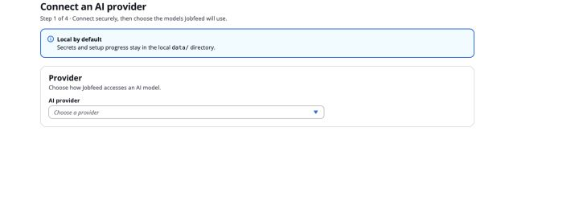
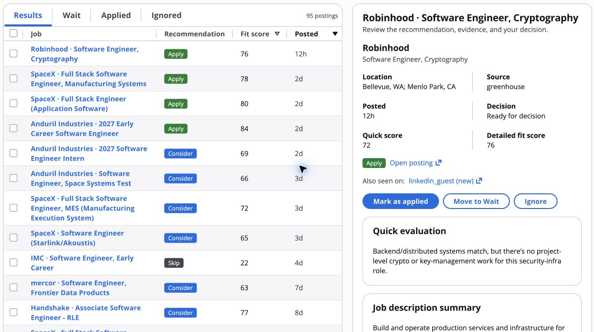
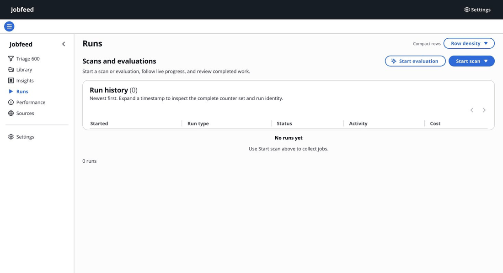
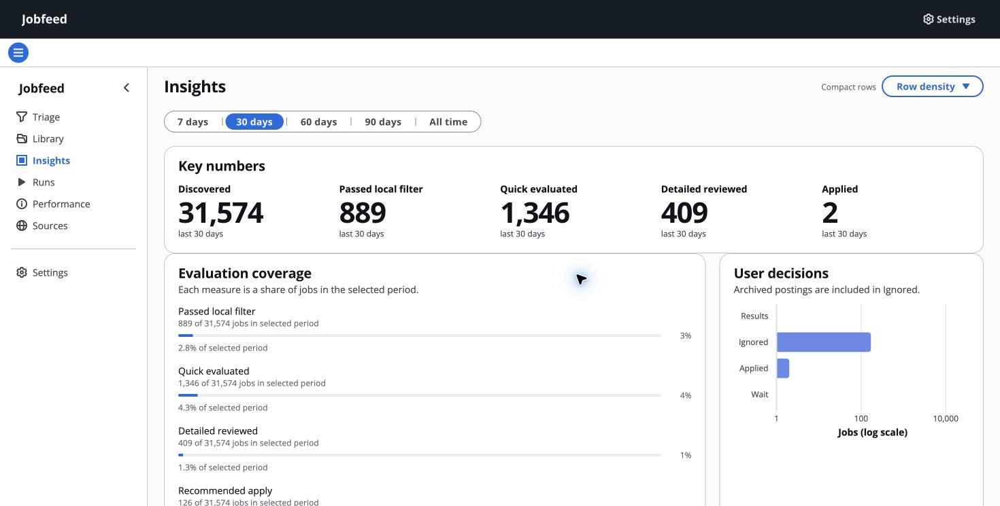
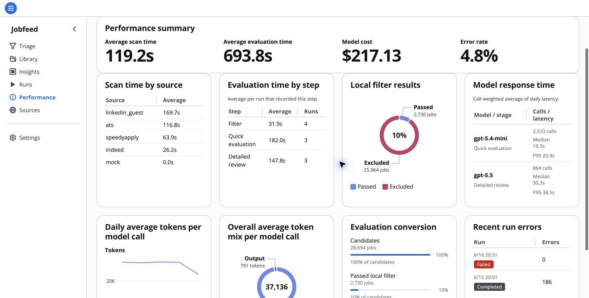

<a id="readme-top"></a>

<div align="center">
  

  <h1>Jobfeed</h1>

  <p>
    A local-first workspace that finds jobs, evaluates fit against your résumé,
    and keeps every decision in one focused interface.
  </p>

  <p>
    <a href="https://github.com/wenqiw777/jobfeed/actions/workflows/ci.yml"></a>
    
    
    
  </p>

  <p>
    <a href="#see-it-in-action"><strong>Demo</strong></a>
    ·
    <a href="#quick-start">Install</a>
    ·
    <a href="#first-run-onboarding">First setup</a>
    ·
    <a href="#workspace-settings">Settings</a>
    ·
    <a href="#everyday-use">Use</a>
    ·
    <a href="#development">Develop</a>
    ·
    <a href="https://github.com/wenqiw777/jobfeed/issues">Report a bug</a>
  </p>
</div>

## Why Jobfeed

Jobfeed turns a scattered job search into one local workflow:

- Complete guided setup before the first scan: connect a model, confirm a
  résumé-derived profile, choose searches, verify company boards, and review
  limits and estimated model usage.
- Scan company career pages, LinkedIn Guest, Indeed, and curated lists. LinkedIn
  Guest fetches complete job descriptions in a paced pass after discovery.
- Cap each source independently and deduplicate the resulting jobs before
  choosing how many unique jobs to evaluate.
- Exclude irrelevant roles before model calls with deterministic filters and an
  optional local ML gate.
- Run quick evaluation followed by detailed résumé-to-job evidence.
- Review the result and record one decision: **Wait**, **Applied**, or **Ignored**.
- Watch scan and evaluation counters update live.
- Keep configuration and job data in a repo-local SQLite database.

**Workflow:** scan jobs → filter noise → evaluate résumé fit → decide what to do.

The normal user path does not require Docker, PostgreSQL, or a frontend build.

## See it in action

### Guided one-command setup

Run `./setup.sh` in Terminal. It installs the local runtime, starts Jobfeed,
and opens the real GUI automatically. A fresh workspace opens the guided
provider step; an existing workspace opens Jobfeed directly.



### Review résumé fit against each job description

Open a posting to compare its quick score, detailed fit score, evidence, and
recommended action before recording your decision.



### Live evaluation progress

The Runs page streams each stage and counter while work is in progress. This
recording uses anonymous deterministic demo jobs and mock model responses.



### Insights

See evaluation coverage and user decisions for the selected time range.



### Performance

Compare scan time, evaluation steps, model latency, token use, conversion, and
recent run errors in one view.



## Quick start

### Prerequisites

- macOS or Linux
- Git
- `curl` only when [`uv`](https://docs.astral.sh/uv/) is not already installed

### Install and open the GUI

```sh
git clone https://github.com/wenqiw777/jobfeed.git
cd jobfeed
./setup.sh
```

`setup.sh` installs `uv` when needed, creates the repo-local Python runtime,
initializes `data/jobfeed.sqlite`, starts Jobfeed on
`http://127.0.0.1:7654`, and opens the setup screen. It also installs a
user-local `jobfeed` terminal launcher.

After the first setup, open a new terminal and run:

```sh
jobfeed
```

With no arguments, `jobfeed` starts or reuses the local server and opens the
GUI. Running `./setup.sh` again is also safe.

## First-run onboarding

A fresh checkout opens `/setup`. Setup is resumable, and **nothing starts a
scan automatically**.

1. **Connect an AI provider.** Choose OpenAI API, Anthropic API, a signed-in
   Codex CLI, or a signed-in Claude Code CLI. Test the connection, then choose
   separate Quick and Detailed models.
2. **Confirm your job profile.** Upload a PDF, DOCX, Markdown, or text résumé.
   Preview the locally extracted text, explicitly send it for analysis, and
   edit every suggested preference before confirming it.
3. **Choose job searches.** Jobfeed turns the confirmed profile into paired
   LinkedIn Guest and Indeed searches across the United States. Each selected
   role direction creates two source queries, and custom titles can be added
   without manually building either URL. The default freshness window is an
   exact 36 hours for LinkedIn and other sources. Indeed keeps its full two-day
   candidate window. Both rules use real posted time when the source provides it.
4. **Choose company boards.** Review profile recommendations whose Greenhouse,
   Ashby, or Lever boards were verified, import the deduplicated broad catalog
   from public new-grad and internship lists, or add a company name, slug, or
   board URL manually. The page reports exactly how many companies were added.
5. **Review the run plan.** Set the unique-job evaluation limit, per-source
   scan totals, hard filters, call limits, concurrency, and the
   Quick-to-Detailed threshold. The usage estimate assumes every selected job
   gets a Quick evaluation and about 30% continue to Detailed review. With a
   Codex or Claude CLI provider, the optional calibration selects a real Indeed
   JD from up to 30 results near the sample's average length and measures one
   Quick plus one Detailed call.

Select **Finish setup** to save the active configuration. Then open **Runs** to
start the first scan or evaluation when you are ready.

## Workspace settings

After onboarding, open **Settings** in the GUI to manage:

- **Résumé** — select the Markdown or text file used as evaluation evidence.
- **Models** — use a signed-in Codex or Claude app, or an OpenAI-compatible API
  endpoint.
- **Sources** — enable feeds, edit search URLs and tracked ATS companies, and
  set one total job cap per source rather than per search URL.
- **Filters** — limit locations, companies, and posting age before evaluation.
- **Evaluation** — set unique-job, daily model-call, API cost, and concurrency
  limits. ATS scans keep only titles derived from your confirmed searches
  before they consume the company-career-page cap.

Saved settings apply without restarting Jobfeed.

The repository includes [`resume.example.md`](resume.example.md) and
[`preamble_personal.example.md`](preamble_personal.example.md) as optional
starting points. Your real résumé, local configuration, and SQLite data are
gitignored.

### Personal job filter

Quick evaluations teach the optional local relevance filter. The first 100
labels establish the baseline, the next 200 score jobs without filtering, and
the next 200 validate the candidate threshold on future jobs. Jobfeed keeps all
jobs visible during this learning and shadow period.

When the filter passes its recall and rejection checks, Jobfeed shows **Your
personal job filter is ready** with measured evidence. It never turns the
filter on automatically. After you review and enable it, rejected jobs remain
recoverable in the Library, a small exploration sample still reaches Quick
evaluation, and filtering pauses automatically if recent recall drops below
90%.

## Everyday use

The GUI is the primary interface. The same runtime also exposes a compact CLI:

| Command | Action |
| --- | --- |
| `jobfeed` | Run the local GUI in the foreground; `Ctrl+C` stops it |
| `jobfeed dev` | Run the API and Vite with hot reload; `Ctrl+C` stops both |
| `jobfeed scan --source mock` | Run an offline smoke scan |
| `jobfeed scan` | Scan the enabled sources |
| `jobfeed enrich-linkedin-guest` | Resume a paced LinkedIn Guest JD-enrichment pass |
| `jobfeed evaluate` | Evaluate eligible jobs against the configured résumé |
| `jobfeed digest` | Render the current digest |
| `jobfeed --help` | List all commands and options |

Use `./bin/jobfeed ...` when you want an explicit repo-local command. Both
entrypoints use the same configuration and SQLite database.

By default, a scan that includes LinkedIn Guest automatically runs one bounded,
paced JD-enrichment pass after discovery. The standalone enrichment command is
for resuming additional or interrupted work.

## Data and privacy

- Runtime data defaults to `data/jobfeed.sqlite`.
- GUI settings are written to `config.toml`.
- Onboarding drafts stay in local `data/onboarding*.json` files, uploaded
  résumés stay in `data/resumes/`, and provider secrets stay in
  `data/secrets.toml` with private file permissions and write-only fields in
  the GUI.
- Jobfeed binds the GUI to loopback (`127.0.0.1`) by default.
- Your résumé, config, database, logs, and generated digests are not committed.
- Résumé text is sent to the selected provider only after you choose
  **Analyze résumé**. Network access otherwise occurs only for the sources and
  model backends you enable.

Back up the SQLite file when you want a portable copy of the workspace.

## Built with

- [Python](https://www.python.org/) and [FastAPI](https://fastapi.tiangolo.com/)
- [SQLite](https://www.sqlite.org/) with [aiosqlite](https://aiosqlite.omnilib.dev/)
- [React](https://react.dev/) and [Cloudscape Design System](https://cloudscape.design/)
- [TanStack Query](https://tanstack.com/query/latest) and [Vite](https://vite.dev/)
- [Click](https://click.palletsprojects.com/) for the CLI

## Development

End users receive the prebuilt GUI and do not need Node.js. Contributors can
install the full development toolchain with:

```sh
uv sync --extra dev --python 3.12
make quality
```

For frontend development with hot reload:

```sh
pnpm --dir web-ui install --frozen-lockfile
jobfeed dev
```

This keeps the API and Vite dev server in one foreground session. Press
`Ctrl+C` once to stop both.

Before submitting a change, run `make quality`. Browser-facing changes should
also be exercised through the real GUI. See
[`docs/engineering-standards.md`](docs/engineering-standards.md) for the
project's coding and verification rules.

### Optional ML model check

The real local ML-gate check is intentionally separate from the fast default
suite because it downloads the embedding model on first use:

```sh
jobfeed ml-gate fetch
pytest -m mlmodel
```

## Project structure

```text
src/jobfeed/
├── domain/      # Pure business rules and models
├── ports/       # Async capability contracts
├── services/    # Workflow orchestration
├── adapters/    # SQLite, sources, models, and external I/O
└── web/         # FastAPI routes and GUI hosting
web-ui/          # React + Cloudscape interface
tests/           # Unit, contract, integration, and browser checks
```

## Contributing

Issues and focused pull requests are welcome. Please describe the user-visible
behavior, include the relevant test evidence, and avoid committing local data
or credentials.

## Acknowledgements

README structure adapted for Jobfeed from
[Best-README-Template](https://github.com/othneildrew/Best-README-Template).
The concise demo-first presentation was inspired by
[holehe](https://github.com/megadose/holehe) and the curated examples in
[awesome-readme](https://github.com/matiassingers/awesome-readme).

<p align="right"><a href="#readme-top">Back to top</a></p>
