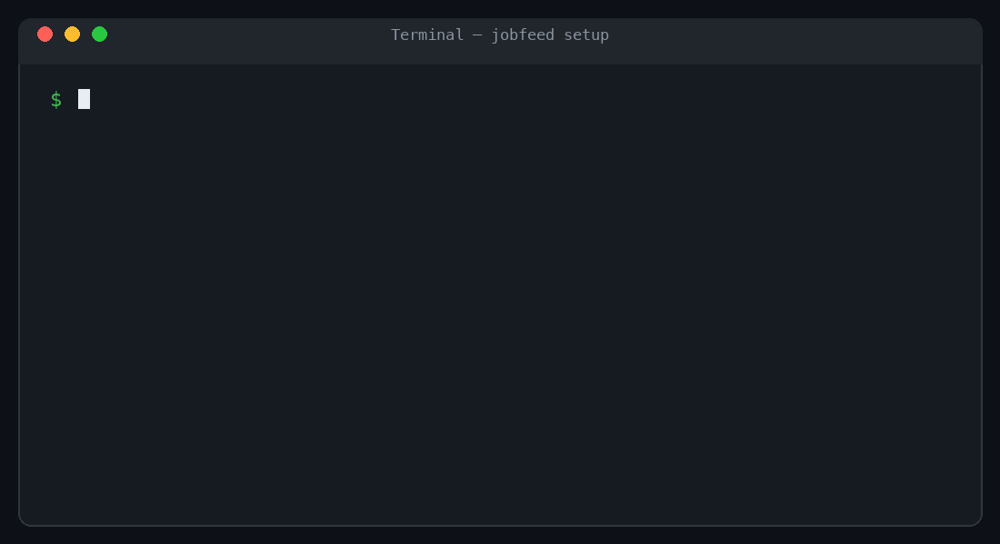

<a id="readme-top"></a>

<div align="center">
  

  <h1>Jobfeed</h1>

  <p>
    A local-first workspace that finds jobs, evaluates fit against your résumé,
    and keeps every decision in one focused interface.
  </p>

  <p>
    <a href="https://github.com/wenqiw777/jobfeed/actions/workflows/ci.yml"></a>
    
    
    
  </p>

  <p>
    <a href="#see-it-in-action"><strong>Demo</strong></a>
    ·
    <a href="#quick-start">Install</a>
    ·
    <a href="#configure-your-workspace">Configure</a>
    ·
    <a href="#everyday-use">Use</a>
    ·
    <a href="#development">Develop</a>
    ·
    <a href="https://github.com/wenqiw777/jobfeed/issues">Report a bug</a>
  </p>
</div>

## Why Jobfeed

Jobfeed turns a scattered job search into one local workflow:

- Scan company career pages, LinkedIn guest search, Indeed, and curated lists.
- Exclude irrelevant roles before model calls with deterministic filters and an optional local ML gate.
- Run quick evaluation followed by detailed résumé-to-job evidence.
- Review the result and record one decision: **Wait**, **Applied**, or **Ignored**.
- Watch scan and evaluation counters update live.
- Keep configuration and job data in a repo-local SQLite database.

**Workflow:** scan jobs → filter noise → evaluate résumé fit → decide what to do.

The normal user path does not require Docker, PostgreSQL, or a frontend build.

## See it in action

### One-command setup

Run `./setup.sh` in Terminal. It installs the local runtime, starts Jobfeed,
and opens the real GUI automatically.



### Review résumé fit against each job description

Open a posting to compare its quick score, detailed fit score, evidence, and
recommended action before recording your decision.


### Live evaluation progress

The Runs page streams each stage and counter while work is in progress. This
recording uses anonymous deterministic demo jobs and mock model responses.


### Insights

See evaluation coverage and user decisions for the selected time range.


### Performance

Compare scan time, evaluation steps, model latency, token use, conversion, and
recent run errors in one view.


## Quick start

### Prerequisites

- macOS or Linux
- Git
- `curl` only when [`uv`](https://docs.astral.sh/uv/) is not already installed

### Install and open the GUI

```sh
git clone https://github.com/wenqiw777/jobfeed.git
cd jobfeed
./setup.sh
```

`setup.sh` installs `uv` when needed, creates the repo-local Python runtime,
initializes `data/jobfeed.sqlite`, starts Jobfeed on
`http://127.0.0.1:7654`, and opens the setup screen. It also installs a
user-local `jobfeed` terminal launcher.

After the first setup, open a new terminal and run:

```sh
jobfeed
```

With no arguments, `jobfeed` starts or reuses the local server and opens the
GUI. Running `./setup.sh` again is also safe.

## Configure your workspace

Open **Settings** in the GUI to manage:

- **Résumé** — select the Markdown or text file used as evaluation evidence.
- **Models** — use a signed-in Codex or Claude app, or an OpenAI-compatible API endpoint.
- **Sources** — enable only the feeds you want Jobfeed to scan.
- **Filters** — limit locations, companies, and posting age before evaluation.
- **Budgets** — set daily model-call, cost, and concurrency limits.

The repository includes [`resume.example.md`](resume.example.md) and
[`preamble_personal.example.md`](preamble_personal.example.md) as optional
starting points. Your real résumé, local configuration, and SQLite data are
gitignored.

## Everyday use

The GUI is the primary interface. The same runtime also exposes a compact CLI:

| Command | Action |
| --- | --- |
| `jobfeed` | Open the local GUI |
| `jobfeed scan --source mock` | Run an offline smoke scan |
| `jobfeed scan` | Scan the enabled sources |
| `jobfeed evaluate` | Evaluate eligible jobs against the configured résumé |
| `jobfeed digest` | Render the current digest |
| `jobfeed --help` | List all commands and options |

Use `./bin/jobfeed ...` when you want an explicit repo-local command. Both
entrypoints use the same configuration and SQLite database.

## Data and privacy

- Runtime data defaults to `data/jobfeed.sqlite`.
- GUI settings are written to `config.toml`.
- Jobfeed binds the GUI to loopback (`127.0.0.1`) by default.
- Your résumé, config, database, logs, and generated digests are not committed.
- Network access occurs only for the sources and model backends you enable.

Back up the SQLite file when you want a portable copy of the workspace.

## Built with

- [Python](https://www.python.org/) and [FastAPI](https://fastapi.tiangolo.com/)
- [SQLite](https://www.sqlite.org/) with [aiosqlite](https://aiosqlite.omnilib.dev/)
- [React](https://react.dev/) and [Cloudscape Design System](https://cloudscape.design/)
- [TanStack Query](https://tanstack.com/query/latest) and [Vite](https://vite.dev/)
- [Click](https://click.palletsprojects.com/) for the CLI

## Development

End users receive the prebuilt GUI and do not need Node.js. Contributors can
install the full development toolchain with:

```sh
uv sync --extra dev --python 3.12
make quality
```

For frontend development with hot reload:

```sh
cd web-ui
pnpm install --frozen-lockfile
pnpm dev
```

Before submitting a change, run `make quality`. Browser-facing changes should
also be exercised through the real GUI. See
[`docs/engineering-standards.md`](docs/engineering-standards.md) for the
project's coding and verification rules.

### Optional ML model check

The real local ML-gate check is intentionally separate from the fast default
suite because it downloads the embedding model on first use:

```sh
jobfeed ml-gate fetch
pytest -m mlmodel
```

## Project structure

```text
src/jobfeed/
├── domain/      # Pure business rules and models
├── ports/       # Async capability contracts
├── services/    # Workflow orchestration
├── adapters/    # SQLite, sources, models, and external I/O
└── web/         # FastAPI routes and GUI hosting
web-ui/          # React + Cloudscape interface
tests/           # Unit, contract, integration, and browser checks
```

## Contributing

Issues and focused pull requests are welcome. Please describe the user-visible
behavior, include the relevant test evidence, and avoid committing local data
or credentials.

## Acknowledgements

README structure adapted for Jobfeed from
[Best-README-Template](https://github.com/othneildrew/Best-README-Template).
The concise demo-first presentation was inspired by
[holehe](https://github.com/megadose/holehe) and the curated examples in
[awesome-readme](https://github.com/matiassingers/awesome-readme).

<p align="right"><a href="#readme-top">Back to top</a></p>
