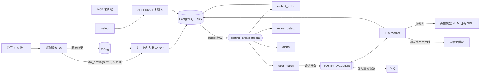

# Jobfeed 托管多用户版：可扩展服务设计

日期：2026-09-24。状态：设计稿，未开始实现。AWS 上的集群形态已选定（第 9 节）。

## 0. 定位

- **目的：** 把 Jobfeed 从本地单用户工具扩展成可托管的多用户服务，并给出从现有代码出发的分阶段路径。
- **真实来源状态：** 本文件是托管版的设计来源。本地单用户版的行为仍以现有代码、contract 测试和 README 为准。实现中如与代码事实冲突，以代码和测试为准，并回来修订本文件。
- **约束：**
  - 本地单用户模式（SQLite、宿主机 `.venv`、浏览器扩展来源）保持可用，默认行为不变。
  - 遵守 `AGENTS.md`：不新增任何 hash 字段、计算或校验。缓存键、去重、增量抓取和幂等判断都用已有 ID、版本号和时间戳。
  - 遵守 `docs/engineering-standards.md` 的代码形状和文档要求。
  - 托管版只使用公开的 ATS 职位接口；LinkedIn Guest、Indeed（jobspy）和浏览器扩展来源只留在本地模式。
- **验收标准：** 见第 7 节各阶段。

## 1. 现状（2026-09-24）

- **形态：** 模块化单体。FastAPI（`jobfeed serve`）和 CLI 在同一进程内运行扫描和评估协程；web-ui 为 React、Cloudscape、TanStack Query。
- **存储：** 8 月从 PostgreSQL 切到单文件 SQLite（WAL，单写入者，短事务排队），跨进程并发靠数据库里的 run lease 和 claims。`PostgresStore` 仍在仓库中。按方法名粗算，端口协议共 121 个方法，SQLite 适配器实现 104 个，Postgres 适配器实现 102 个。Postgres 缺的 9 个是：`start_run_with_lease`、`renew_run_lease`、`checkpoint_run_with_lease`、`finalize_run_with_lease`、`recover_expired_run_leases`、`link_restarted_run`、`stop_pipeline_run`、`save_job_batch`、`sync_stage_b_threshold`。Postgres 测试线已于 2026-08-13 从 CI 移除。
- **抓取：** ATS 适配器（Greenhouse、Lever、Ashby、SmartRecruiters、Workday、iCIMS）、LinkedIn Guest、Indeed（jobspy）、精选列表。可选的 Redis Streams 任务日志（`[redis_pipeline].enabled`）采用"先提交数据库、再确认消息"，批次回执保证重放安全。
- **评估：** 本地 ML gate（XGBoost，fastembed 向量）→ Quick evaluation（Stage A）→ 约 30% 进入 Detailed review（Stage B）。有每日模型调用数、API 成本和并发上限。LLM 适配器覆盖 Claude、OpenAI、Azure OpenAI 和 Bedrock。
- **已有本地模型实验（离线，未上生产）：** seniority 本地分类器（MiniLM 向量加 logistic，1000 条标注）、GLiNER2 的 LoRA 微调可行性实验、SDE 分类器对比。
- **可观测性：** OpenTelemetry（FastAPI、httpx、asyncpg 埋点）、Sentry。CI 为 GitHub Actions。
- **运行位置：** 开发者本机。

## 2. 目标与非目标

**目标：**

1. 多用户：每个用户有自己的简历、筛选条件、评估结果、状态和预算，用户之间数据隔离。
2. 可水平扩展：API、抓取、匹配、LLM 评估各自独立扩缩。
3. 成本可控：LLM 调用经过分层筛选、结果复用和每用户预算。
4. 在 50 万到 100 万条岗位、几百个用户的规模下正常工作，并用压测证明。
5. 本地单用户模式继续可用，两种存储后端通过同一套 contract 测试。
6. 提供 MCP 接口，供 Claude Code、Cursor 这类 agent 使用。

**非目标（本期不做）：**

- Kafka（理由和切换条件见 D3）。
- GraphQL、移动端、付费方案。
- 托管版中的 LinkedIn Guest、Indeed 和浏览器扩展来源。

## 3. 规模估算（设计依据，数字均为估计）

| 项 | 估算 | 结论 |
|---|---|---|
| 岗位库 | 50 万条；正文每条 5 到 10 KB，共 2.5 到 5 GB；384 维向量约 750 MB | 单个 RDS PostgreSQL 可容纳 |
| 抓取事件 | 每天全量重查 50 万条：平均约 6 条/秒；集中在 1 小时内约 140 条/秒 | Redis Streams 单节点余量有两三个数量级 |
| 新增或变更 | 按每天 10% 估，约 5 万条 | 决定匹配和评估的日工作量 |
| 全配对打分 | 5 万条 × 100 用户 = 每天 500 万对；1% 送大模型即 5 万次调用，每次 0.3 到 1 美分，每天 150 到 500 美元 | 不可接受，必须先检索再精排（D4） |

结论：在这个规模下，先撑不住的是外部来源的限流和 LLM 成本，不是消息系统。

## 4. 目标架构

| 组件 | 职责 | 扩缩依据 |
|---|---|---|
| API（FastAPI） | 认证、查询、结果展示、MCP HTTP 入口；无状态 | HPA，按 CPU 和延迟 |
| 抓取服务（Go） | 并发拉取公开 ATS 接口，按域名限速、退避重试；只做网络 I/O 和原始结果落地 | 公司看板任务队列的积压 |
| 归一化和去重 worker（Python） | 复用现有来源解析、去重和按质量合并写入的代码；写 jobs 表；经 outbox 发出岗位事件 | raw 事件积压（KEDA Redis Streams scaler） |
| 事件消费者（Python） | `embed_index`、`user_match`、`repost_detect`、`alerts` 四个 consumer group，各自进度独立 | 各自 stream 积压（KEDA） |
| LLM worker（Python） | 从 SQS 取评估任务；先调本地蒸馏模型，通过或不确定的再调云端大模型；遵守每用户预算和全局限流；失败按可见性超时重试，超过次数进 DLQ | SQS 队列深度（KEDA SQS scaler） |
| 蒸馏模型服务（vLLM，自有 GPU） | 提供 OpenAI 兼容接口，经私有网络供集群调用；见 D7 | GPU 机器本身的吞吐 |
| PostgreSQL（RDS） | 共享表加按用户的表；行级安全；pgvector HNSW；jobs 按日期分区；量大后加只读副本给 UI 查询 | 实例规格，必要时读副本 |
| Redis（集群内） | Streams、结果缓存、限流计数；丢失后可由 PostgreSQL 和 outbox 恢复 | 内存规格 |
| S3 | 简历文件、下线岗位归档 | 不需要 |
| MCP server | 本地 stdio；托管版 streamable HTTP | 随 API |

## 5. 关键设计决定

### D1 存储：托管用 PostgreSQL，本地保留 SQLite

- **原因：** 托管版有多个 API 副本和 worker 同时写库；SQLite 同一时间只允许一个写入者。PostgreSQL 还提供行级安全（多租户）和 pgvector。
- **做法：** 补齐 Postgres 适配器缺的 9 个方法，run lease 用 PostgreSQL 行锁或 advisory lock 实现；恢复 Postgres 的 contract 和 integration 测试线，两种后端跑同一套测试；schema 变更沿用仓库现有的 migrations 机制。
- **代价：** 两套适配器需要同步维护，每新增一个 store 方法都要两边实现并通过 contract 测试。

### D2 多租户

- **共享数据：** jobs、companies、enrichment、下线岗位记录、岗位向量。
- **按用户数据：** 简历版本、筛选条件、评估结果（依赖简历）、状态和历史、申请记录、面试轮次、成本和 LLM 用量账本、预算。具体归属在阶段 2 开始前逐表确认。
- **做法：** 按用户的表加 `user_id`；PostgreSQL 行级安全策略按会话变量里的当前用户过滤。API 每个请求设置当前用户；后台 worker 按任务里的 `user_id` 设置。
- **评估结果复用键：** `(job_id, resume_version_id, evaluator_version)`，不使用 hash。
- **风险：** 改动最大的一块。现有 store 方法中涉及按用户数据的，全部要带上用户上下文。

### D3 消息：Redis Streams 管岗位事件，SQS 管 LLM 评估任务，暂不引入 Kafka

- **岗位事件**（已经发生的事实）有多个下游，进度各不相同，出错后各自重跑：用 Redis Streams 的 consumer group。
- **LLM 评估**（需要执行的任务）慢、会失败，需要逐条重试，且一条卡住不能挡住其他任务：用 SQS（可见性超时重试、DLQ、按队列深度扩缩）。
- **事件只带 ID**（claim check），正文在 PostgreSQL。
- **写库与发事件的一致性：** transactional outbox。业务行和 outbox 行在同一事务中写入，由转发器发到 stream，发送后标记。消费者按事件 ID 和业务 ID 判断是否已处理，保证幂等。这与现有"先提交数据库、再确认消息"的做法一致。

**选项对比：**

| 方案 | 多个下游 | 重放 | 单条重试和死信 | 运维和成本 | 结论 |
|---|---|---|---|---|---|
| Redis Streams（现有） | 支持，consumer group | 有限，受内存限制 | 支持，超时消息可重新认领；死信自己实现 | 已在用；托管版放在集群内，不额外花钱 | 采用（岗位事件） |
| PostgreSQL 作队列（SKIP LOCKED 加 outbox） | 每个下游一张认领表 | 数据在表中 | 支持 | 不新增组件 | 量小时最简单，量大时数据库成瓶颈；现有评估 claims 即此模式 |
| SNS + SQS | 支持，SNS 扇出 | 不支持 | 内置，最完善 | 全托管，费用极低 | 采用 SQS（LLM 任务） |
| Kinesis Data Streams | 支持 | 支持，最长 365 天 | 按分片顺序处理，慢消息会阻塞 | 托管，每月十几到三十美元 | 备选 |
| Kafka（Strimzi 自建） | 最强 | 最强，长保留、compaction | 需自建重试 topic | JVM 内存开销，分区和升级要自己管 | 暂不采用 |
| Amazon MSK | 同 Kafka | 同 Kafka | 同 Kafka | 省运维，最小配置每月约七八十美元 | 暂不采用 |
| Redpanda | 兼容 Kafka 协议 | 同 Kafka | 同 Kafka | 单个 C++ 进程，资源占用小 | 若换 Kafka 语义时的轻量选项 |

- **暂不用 Kafka 的理由：** 现规模峰值每秒百来条事件；PostgreSQL 是真实数据源，重新评估可以从库里重新入队，不依赖日志重放；Kafka 会增加一个有状态系统的运维，并行度受分区数限制，慢消息会阻塞分区。
- **切换到 Kafka 的条件（任一满足）：** 持续每秒上万条事件；需要把原始事件保留数周以上用于重放或分析（例如岗位变化历史）；独立下游明显增多且需要各自重建派生数据；需要用 CDC（Debezium）把 PostgreSQL 变更同步到其他系统。
- **切换路径：** outbox 转发器改为发往 Kafka，consumer group 语义保持不变；LLM 任务仍走 SQS。

### D4 评分：先检索再精排，分层过滤

不再对每个（岗位，用户）全配对打分：

1. 岗位向量只算一次（`embed_index`），所有用户共享。
2. `user_match` 对每个用户，用 pgvector HNSW 在符合其筛选条件的新岗位中检索前 K 条。
3. 现有 ML gate（XGBoost）过滤。
4. 本地蒸馏模型（D7）再筛一层。
5. 通过的生成 SQS 评估任务，进入 Stage A，部分进入 Stage B，沿用现有两段式。

**成本控制：** 每用户每日预算（现有的每日调用数和成本上限改为按用户）；评估结果按 D2 的复用键复用；可批量的调用走供应商 batch API；共享的 prompt 前缀使用供应商的 prompt caching。

**验收：** 在 50 万条岗位的数据集上测每个用户一次匹配的 p99 延迟；每用户每天的 LLM 调用数和成本；在抽样集上与全配对基线比较召回。

### D5 抓取：Go 抓取服务，增量抓取

- 只覆盖公开 ATS 职位接口：Greenhouse、Lever、Ashby、SmartRecruiters。
- **增量：** 先拉看板列表，按来源原生岗位 ID 和来源提供的更新时间比较，只抓新增和变更的详情，不做内容 hash。
- 按域名限速，指数退避。公司看板作为任务放入队列，由多个抓取 pod 领取，不用一致性哈希分配。
- Go 只负责网络 I/O 和原始结果落地；解析、归一化、去重仍由现有 Python 代码负责，避免两套业务逻辑。
- **验收：** 同一批看板，Go 版与现有 Python 版产出的岗位 ID 集合一致；记录每分钟处理的看板数和岗位数，以及限速下的错误率。

### D6 平台：AWS 上的 Kubernetes，Terraform 管理

- **工作负载：** api Deployment（HPA）；fetcher Deployment（按看板队列积压扩缩）；归一化和事件消费者 Deployment（KEDA Redis Streams scaler）；llm-worker Deployment（KEDA SQS scaler）；CronJob 负责发起每日扫描、清理和归档。
- **AWS 资源（Terraform）：** VPC、EC2 Spot 自动伸缩组（跑 k3s）、压测用 EKS、RDS PostgreSQL、SQS（含 DLQ）、S3、ECR、IAM、SSM Parameter Store（LLM key）、Elastic IP、AWS Budgets。Redis 在集群内运行。
- **CI/CD：** GitHub Actions 构建镜像，推送 ECR，部署到集群；PR 上用 kind 集群跑端到端冒烟测试。
- 集群形态见第 9 节：平时是 EC2 Spot 上的 k3s，压测时临时开 EKS。

### D7 本地蒸馏模型（PyTorch 加 LoRA，自有 GPU）

- **用途：** 在 ML gate 和云端大模型之间加一层便宜的判断，减少云端 LLM 调用。
- **训练数据：** 已存的 Stage A 和 Stage B 结果作为标签，把大模型的判断蒸馏到小模型。
- **主方案：** 用 PyTorch 加 LoRA（PEFT）微调一个 1 到 2B 的开源 LLM，在自有 GPU 上训练，承担 Stage A 式的快速判断。判为通过的和把握不大的，再交给云端大模型。
- **服务：** 在 GPU 机器上用 vLLM 提供 OpenAI 兼容接口，通过私有网络（例如 Tailscale）供集群调用。Jobfeed 现有的 OpenAI 适配器改 base URL 即可接入，不新增适配器。也可以把 GPU 机器作为 k3s 的 GPU 节点加入集群；二选一，阶段 3 开始时再定。
- **基线和后备：** cross-encoder 重排序模型（PyTorch 微调，CPU 可跑）作为对比基线，也作为 GPU 机器离线时的后备。两者都不可用时，任务留在队列中等待，或按配置直接交给云端大模型。
- **评估纪律：** 沿用 seniority 和 GLiNER2 实验的做法：按公司分组划分 train、dev、test，只在留出集上报指标，不新增 hash。
- **验收：** 留出集上与 Stage A 的一致率和漏判率（应送大模型却被挡掉的比例）；GPU 上每秒完成的判断数和延迟；上线后云端 LLM 调用数和成本的下降比例；GPU 离线时后备路径能正常接管。

### D8 MCP server

- **工具：** `search_jobs`、`get_job`、`top_matches`、`explain_match`、`update_status`。
- **传输：** 本地 stdio；托管版 streamable HTTP，按用户 token 鉴权，走同一套行级安全。
- 通过现有 service 层访问数据，不直接访问存储。
- **验收：** Claude Code 和 Cursor 能列出并调用全部工具；只读工具不修改数据；`update_status` 走与 web 相同的状态转移校验。

### D9 可观测性与 SLO

- 沿用 OpenTelemetry 和 Sentry；补充指标导出（Prometheus 或 OTel metrics）和 Grafana 看板。
- **核心指标：** API p50/p99 延迟和错误率；岗位新鲜度（来源发布到入库的延迟）；各 stream 积压和最老未处理事件的年龄；SQS 队列深度和 DLQ 数量；每用户每日 LLM 调用数和成本；各 Deployment 副本数变化。
- **初始 SLO（压测后校准）：** API p99 低于 300 ms；新岗位入库新鲜度低于 2 小时；评估积压年龄低于 30 分钟。

### D10 安全与数据

- 简历文件存 S3（服务端加密），数据库只存引用；用户删除账号时删除其全部数据。
- 密钥放 SSM Parameter Store（SecureString），不进入镜像和配置文件。
- 托管版只使用公开 ATS 接口，遵守各来源的限速和使用条款。

## 6. 扩展到几十万条岗位时的要点

- 事件只带 ID；增量抓取；先检索再精排；jobs 按日期分区，下线岗位归档到 S3；UI 查询量大后加只读副本。
- 预计瓶颈出现的顺序：外部来源限流、LLM 成本、PostgreSQL 写入与索引、消息系统。

## 7. 分阶段计划与验收

### 阶段 1：上云（约 1 周）

- **内容：** MCP server（本地 stdio 先行）；Postgres 适配器补齐 9 个方法并恢复 Postgres 测试线；容器镜像；Terraform 基础环境；单用户版部署到 Kubernetes（api，加扫描和评估任务），连接 RDS。
- **验收：**
  - 两种后端的 contract 测试全部通过。
  - `terraform apply` 能从零建出环境，`terraform destroy` 能完全清除。
  - 集群上一次完整的扫描加评估运行成功，结果在 web 上可见。
  - MCP 工具可以从 Claude Code 调用。

### 阶段 2：多用户和扩展（1 到 2 周）

- **内容：** 用户认证；按用户数据加 `user_id` 和行级安全；每用户预算；岗位事件 stream 和四个 consumer group；outbox；SQS LLM worker 和 KEDA；先检索再精排；k6 压测脚本和 50 万到 100 万条岗位的压测数据集；Grafana 看板。
- **验收：**
  - 跨用户隔离的负向测试通过（用户 A 的会话读不到用户 B 的任何行）。
  - 压测报告：并发数、p50/p99、错误率、扩缩过程。
  - 实测每用户每日成本。

### 阶段 3：模型和 Go（约 1 周，可与阶段 2 并行）

- **内容：** LoRA 微调的小 LLM（自有 GPU 训练，vLLM 服务）接入评估链路，cross-encoder 作为基线和后备；Go 抓取服务。
- **验收：** 见 D5 和 D7。

## 8. 基线与验收目标

基线取自 2026-09-24 的本地数据库：jobs 表 143,802 条；公司看板 520 个（Greenhouse 255、Ashby 200、Lever 65）；已完成评估 Stage A 30,370 条、Stage B 9,609 条；9 月以来 30 次完整扫描耗时中位数 8.3 分钟，新岗位超过 1,500 条的日子最长 48 分钟。

| 指标 | 基线 | 目标 | 来源 |
|---|---|---|---|
| API 延迟和错误率 | 无 | 300 个并发用户下 p99 低于 300 ms，错误率低于 1% | k6 压测 |
| 扩副本后的吞吐 | 无 | 8 个副本的吞吐至少是 2 个副本的 3 倍 | k6 压测加 HPA 记录 |
| 每用户一次匹配的延迟 | 无 | 50 万条岗位下低于 100 ms | 压测数据集 |
| 抓取覆盖和耗时 | 520 个看板 | 5,000 个看板 10 分钟内抓完，产出与 Python 版一致 | 抓取服务指标 |
| 评估积压排空 | 无 | 1 万条积压约 15 分钟清完；扩容反应低于 2 分钟 | SQS 和 KEDA 指标 |
| 每用户每日 LLM 调用和成本 | 全配对估算约每人每天 500 次调用 | 比全配对少 90% 以上；约每人每天 0.1 美元 | 成本账本 |
| 蒸馏模型一致率和漏判率 | Stage A 30,370 条、Stage B 9,609 条可作训练数据 | 留出集一致率至少 90%，漏判率不高于 5% | 留出集 |
| 蒸馏后的云端 LLM 花费 | 上线前同等工作量的花费 | 降低 60% | 成本账本 |
| GPU 判断吞吐 | 无 | 每秒至少 10 条 | vLLM 指标 |
| 一次完整扫描耗时 | 中位数 8.3 分钟，最长 48 分钟 | 重负载日 15 分钟以内 | 运行记录 |
| MCP 工具调用延迟 | 无 | 低于 200 ms | MCP server 日志 |
| 从代码重建整套环境 | 无 | 约 15 分钟 | `terraform apply` 计时 |
| 节点被回收后的恢复 | 无 | 10 分钟以内 | 故障演练 |
| 常驻月成本 | 无 | 约 30 美元 | AWS 账单 |
| 真实用户数 | 1 | 30 以上 | 用户表 |

目标没达到时，以实测值为准，并回来修订本表。

## 9. AWS 上的集群形态（2026-09-24 已定）

**选定：** 平时在一台 EC2 Spot 实例上跑 k3s，数据库用 RDS；压测时用 Terraform 临时开 EKS，测完销毁。两种集群形态使用同一套 manifest。

**常驻资源和月成本（us-east-1 估算）：**

| 资源 | 规格 | 每月约 |
|---|---|---|
| EC2 Spot（跑 k3s） | Graviton，t4g.medium 级别；自动伸缩组固定 1 台，允许多种实例类型 | 8 到 10 美元 |
| EBS | 20 GB gp3 | 2 美元 |
| Elastic IP | 1 个公网 IPv4 | 4 美元 |
| RDS PostgreSQL | db.t4g.micro，单可用区，20 GB | 14 美元 |
| SQS、S3、ECR | 按用量 | 1 美元左右 |
| 合计 | | 约 28 到 30 美元 |

压测时的 EKS 另计，每次几美元。蒸馏模型所在的 GPU 机器在 AWS 之外，不计入上表，需要一条私有网络连到集群。

**省钱措施：**

- 不用 NAT 网关：节点放公有子网，靠安全组控制入站；RDS 放私有子网，只允许节点访问。
- 不用 ALB：k3s 自带的 Traefik 做入口，证书用 Let's Encrypt。
- Redis 放在集群内，不用 ElastiCache。
- 密钥放 SSM Parameter Store（SecureString），不用 Secrets Manager。
- 镜像构建为 arm64。
- AWS Budgets 设预算告警（例如 30 美元）。

**Spot 回收的处理：**

- 状态不放在节点上：数据在 RDS，镜像在 ECR，manifest 在 Git，密钥在 Parameter Store。
- 收到回收通知（提前 2 分钟）时 drain 节点，例如用 aws-node-termination-handler，或一个轮询实例元数据的小脚本。
- 自动伸缩组起新实例；开机脚本安装 k3s，把 Elastic IP 绑到新实例，从 Git 部署 manifest。k3s 自身的集群状态随节点重建，所有工作负载都能从 Git 恢复。
- 集群内 Redis 的数据会随节点丢失：outbox 转发器把最近 24 小时的事件重新发出，消费者按事件 ID 幂等处理，重复消息无害；SQS 在集群外，任务不受影响。
- **验收：** 手动终止节点后，服务在 10 分钟内自动恢复；SQS 中的任务不丢，stream 中的事件由 outbox 重发补齐。

## 10. 风险

| 风险 | 缓解 |
|---|---|
| 多租户改造面大 | 阶段 2 开始前先列出按用户数据的表和方法清单，contract 测试先行 |
| LLM 成本失控 | 每用户预算默认开启，设全局日上限，超额即停 |
| Kubernetes 运维负担 | 工作负载保持无状态，状态放在托管服务（RDS、SQS、S3、ECR）和 Git |
| 来源限流或条款变化 | 只用公开接口，按域名限速，失败退避 |
| 两套存储适配器漂移 | CI 中两条测试线都设为必过 |
| GPU 机器离线 | 后备到 cross-encoder 或云端大模型；队列积压触发告警 |
| Spot 实例被回收 | 状态不放在节点上；自动伸缩组重建节点；outbox 重发事件（第 9 节） |

## 11. 待决问题

- 认证方式：Cognito，还是在 FastAPI 中自建 OAuth 登录（例如 Google）。
- 托管版默认使用哪家 LLM，是否允许用户自带 key。
- 真实用户的来源，以及数据保留期限。
