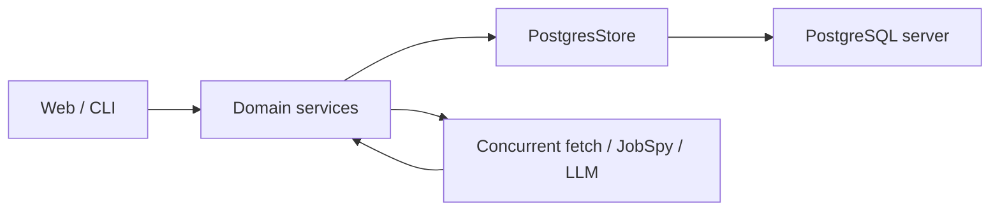
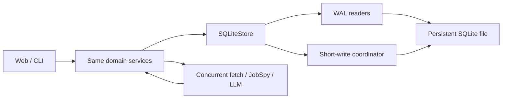

# Jobfeed PostgreSQL → SQLite 重构影响与实施设计

**状态：** APPROVED / IMPLEMENTATION-READY  
**验证日期：** 2026-08-11  
**适用仓库：** `/Users/wenqiwang/wwq/jobfeed`  
**候选阶段：** Phase 10，但本文件不覆盖旧 Phase 9 文档里占位的 network/auth 工作  
**文档目的：** 定义数据库切换的行为边界、影响面、代码量、工时、迁移方式和验收证据  
**实现时的 source of truth：** 本计划优先于旧的 PostgreSQL-only 设计；执行必须按 task dependency 和 acceptance evidence 推进

## 1. 结论

Jobfeed 适合从 PostgreSQL 收敛为 SQLite，但这不是“小改连接串”，而是一次中大型存储后端重写。

推荐的最终架构是：

- 继续使用模块化单体和现有六边形分层。
- 不拆 microservices，不引入 Temporal，不增加常驻 job worker。
- PostgreSQL 单后端迁移为 SQLite 单后端，不长期维护双后端。
- 抓取、JobSpy 子进程和 LLM 调用继续并发。
- SQLite 使用 WAL、`foreign_keys=ON`、`busy_timeout` 和短写事务。
- 同进程写操作通过 adapter 内单写协调器排队；跨进程安全由 SQLite 文件锁和 `BEGIN IMMEDIATE` 保证。
- 所有付费 evaluation claim、状态转换、apply audit 和自然键 upsert 保持原子与幂等。
- 使用停写窗口做一次性 PostgreSQL → 临时 SQLite 文件迁移，校验成功后才原子切换。
- Runtime storage 采用模块化 Hybrid Core：简单 CRUD/schema/mapping 使用 SQLAlchemy Core，关键 claim/lease/status/apply 事务保留显式 SQL；目标约 3,500 LOC，而不是复制一个新的 5,895 行 god object。

含无损回滚的推荐预算是 **194–292 人类工程小时**。采用 3 个并行执行 agent 加 1 个集成 owner，合理日历时间是 **12–18 个工作日实施与验证，另加至少 7 天 soak**。并行只缩短日历时间，不减少总工程投入。代码 churn 预计 **20,000–30,000 LOC，误差约 ±30%**。

## 2. 已锁定目标、约束与非目标

### 2.1 目标

用户继续通过相同的 CLI 和 Web 页面完成 scan、evaluate、triage、apply、runs 和 performance 操作，但不再需要维护 PostgreSQL server。

完成后应满足：

1. 一份持久化 SQLite 数据库保存全部 Jobfeed 数据。
2. 删除 CLI 容器后数据仍存在；重复启动看到同一份数据。
3. fetch 和 LLM 并发度不降低。
4. Web 与 CLI 同时运行时，不重复领取付费 evaluation job。
5. 现有 90 个 store port 操作和 2 个由 store 实现的 source lookup 操作保持业务行为等价。
6. 当前 PostgreSQL 数据完整迁移，失败时不会替换正式 SQLite 文件。

### 2.2 约束

- `./bin/jobfeed ...` 仍是正式用户入口。
- `domain/` 继续纯 stdlib；`services/` 不依赖具体数据库 adapter。
- 不把网络请求或 LLM 调用放进数据库事务。
- 不以削弱 `make quality`、测试标记或行为合同的方式完成切换。
- 数据迁移必须先备份、后导入、再校验，校验失败不得切换。
- 只有一个主 agent 负责合并；并行写同一仓库时使用隔离 worktree。

### 2.3 明确非目标

- 不做 microservices 拆分。
- 不引入 Temporal、Redis、Kafka、Celery 或外部 queue。
- 不做长期 PostgreSQL/SQLite 双后端产品支持。
- 不改变 scoring、ML gate、状态机、apply、Web API 或页面语义。
- 不顺带重做前端、鉴权、network mode 或现有 observability 产品设计。
- 不把当前 `serve` 端口暴露问题混入本数据库重构。
- 不把 best-effort LLM budget gate 改成严格全局预算，这是另一项行为变更。

## 3. 实际当前状态

以下结论来自 2026-08-11 对当前 `main` 代码和本地数据的实测，不来自阶段文档推断。

### 3.1 代码与 schema 基线

| 范围 | 实测规模 | 含义 |
|---|---:|---|
| `src/jobfeed/adapters/store/postgres.py` | 5,895 LOC | 当前唯一数据库实现 |
| Store ports | 8 文件、1,451 LOC、90 个协议方法 | SQLite 必须覆盖的正式行为合同 |
| Store-backed source lookups | `EnrichmentLookup` + `ClosedJobLookup`、2 个协议方法 | 同样是 SQLite runtime 合同，不得被 store-only 口径漏掉 |
| PostgreSQL migrations | 0001–0008、742 LOC | PG 原生 DDL，不能原样重放到 SQLite |
| `legacy_import.py` + `parity.py` | 1,323 LOC | 方向是旧 SQLite → PG，不是本次迁移方向 |
| 核心数据层 | 9,425 LOC | 不含 CLI、配置、部署和测试 |
| `PostgresStore` | 110 个 public 方法、119 个总方法 | 90 个 store port + 2 个 source lookup 外还有 18 个迁移专用能力 |
| PostgreSQL 测试选择集 | 433 / 1,885 tests，约 23% | `pytest --collect-only -m postgres` 实测 |
| 显式 PG 测试影响面 | 35–38 文件、约 14.9k–15.0k LOC | 口径差异来自 marker 与直接引用统计 |
| 直接 import `PostgresStore` 的测试 | 31 文件 | 不只是替换一个 fixture |
| 当前 `main` schema | 14 张表 | 见迁移清单；目标 SQLite 另增 1 张 `run_leases` |

当前 store 依赖 [postgres.py](/Users/wenqiwang/wwq/jobfeed/src/jobfeed/adapters/store/postgres.py)、[store ports](/Users/wenqiwang/wwq/jobfeed/src/jobfeed/ports/store.py)、[config.py](/Users/wenqiwang/wwq/jobfeed/src/jobfeed/config.py)、[CLI wiring](/Users/wenqiwang/wwq/jobfeed/src/jobfeed/cli/__init__.py)、[docker-compose.yml](/Users/wenqiwang/wwq/jobfeed/docker-compose.yml)、[CI](/Users/wenqiwang/wwq/jobfeed/.github/workflows/ci.yml) 和 [test fixtures](/Users/wenqiwang/wwq/jobfeed/tests/conftest.py)。

这里的“90 个 store 行为”是 8 个 capability protocol 中定义的 90 个持久化方法，不是 90 张表或 90 个用户功能。另有 `EnrichmentLookup.get_enrichment` 和 `ClosedJobLookup.get_closed_canonical_ids` 两个由 store 承担的 runtime source 行为，所以现有 runtime 持久化合同实际是 92 个。90 个 store 方法按职责分布为：

| Capability | 方法数 | 典型职责 |
|---|---:|---|
| 核心 `JobStore` | 20 | jobs、Stage A/B、ML gate、pipeline runs |
| Ops | 20 | company、enrichment、state、cost、LLM usage、maintenance |
| Status | 12 | transition、history、follow-up、bulk/twin status |
| Application | 10 | application、resume snapshot/variant |
| Claims | 8 | Stage A/B claim、preview、release、refresh |
| Ext | 9 | batch evaluation、Stage B preview、interview rounds |
| Performance | 6 | step timing、overview、LLM/funnel aggregation |
| Views | 5 | jobs view、twins、runs、insights |

数量大的原因是项目不用一个无类型的通用 `execute()`，而是把每个业务查询和原子命令显式放在 port 上；同时 Phase 1–9 的 jobs、evaluation queue、workflow、application 和 analytics 能力最终都由一个 concrete store 实现。显式合同本身保护了 service/adapter 边界，但单个 5,895 行实现已经形成维护热点。

这 92 个是“必须解释的现有行为 inventory”，不是最终必须保留的 public method 数。Task 0 必须给每个行为标记 `retain`、`merge`、`compat-wrapper` 或 `retire`；只有证明无 production 调用、无 CLI/API 合同、无必要兼容用途的项才可退休。相同 eligibility、filter/sort、transaction 或 single/batch 语义应收敛到 typed command/query family。逐项调用与事务审计后，当前可执行 baseline 收口为 **78 个 public operations**，而不是原样复制 92 个方法或为追求数字硬压到 60。进一步的全调用链审计给出 **70 个的推荐终态**，但其中严格原子预算 reservation 是 material behavior change；在人类选择第 8.2 节方案前，78 仍是 implementation acceptance，不得把候选当作隐式删减。

run lease 新增 `start_run_with_lease`、`renew_run_lease`、`finalize_run_with_lease` 3 个明确行为，因此完整 disposition 输入是 92 个既有行为加 3 个新行为，即 95 个。`start_run_with_lease` 将 lease acquire 和 running `PipelineRun` insert 放在同一事务，不允许产生“已领 lease 但没有 run”的半状态。18 个迁移专用方法单独归入 cutover/rollback tooling，不塞进 runtime facade。行为可以通过合并后的一个 typed operation 保留；合并不得把原子边界、输入类型、排序或错误语义藏进通用 `execute()`。

### 3.2 当前本地数据快照

| 指标 | 实测值 |
|---|---:|
| 数据库大小 | 约 413 MB |
| `jobs` 表大小 | 约 375 MB |
| jobs | 56,507 |
| evaluations | 6,898 |
| pipeline runs | 38 |
| companies | 424 |
| llm usage | 3,184 |
| step timings | 9 |
| applied | 0 |
| shortlisted | 0 |
| 最后 pipeline/job 活动 | 2026-06-17 |

当前数据 schema 只到 migration `0007`，而当前 `main` 代码读取 `0008` 新增的 `pipeline_runs.jobs_gate_passed`。这已经导致 Runs/Performance 部分 API 对真实数据返回 500。任何迁移 rehearsal 的第一个前置条件都是先在备份上把 source PostgreSQL 升到 `0008` 并通过 smoke。

当前已发布 GHCR `latest` 也落后于 `main`，镜像内只有 0001–0007。数据库切换不能基于该旧镜像做最终 rehearsal。

### 3.3 当前不是分布式多 worker

实际运行模型如下：

- Web 进程内只有一个 `RunManager`。
- scan 和 evaluate 各有一个 `asyncio.Lock`；同类第二次 Web trigger 返回 409。
- `asyncio.create_task()` 负责 Web 后台运行，默认 `serve` 是单 Uvicorn 进程。
- CLI 是独立进程，直接 `asyncio.run()` 完成 scan/evaluate，不经过 Web 的 `RunManager` 锁。
- `ScanService` 并发 fetch sources；ATS/SpeedyApply 在内部继续并发 company/posting。
- JobSpy 临时子进程只 scrape 并返回 `JobPosting`，不访问数据库，不消费 DB queue。
- Evaluate 先原子 claim 一批 job，再用 semaphore 并发调用 LLM，结果以短事务写回。

因此，SQLite 的“单 writer”只限制数据库写事务，不会把 fetch、scrape 或 LLM 变成单 worker。

## 4. Before / After

| 维度 | Before：PostgreSQL | After：SQLite |
|---|---|---|
| 应用架构 | 模块化单体 | 不变 |
| 正式入口 | Docker `./bin/jobfeed` | 不变 |
| 数据位置 | PostgreSQL server + Docker volume | 一个持久化 SQLite 文件 + WAL |
| 数据库进程 | 独立 Postgres container | 无独立 DB server |
| 读取并发 | asyncpg pool，多连接 | WAL 下并发读取 |
| 写入并发 | 多 writer、row lock | 单 writer、短事务排队 |
| 外部 I/O | source/company/posting/LLM 并发 | 不变 |
| JobSpy | 临时 scrape 子进程 | 不变 |
| evaluation claim | `FOR UPDATE SKIP LOCKED` + lease | `BEGIN IMMEDIATE` 内原子选择、guarded update、commit |
| Web 同类 run 互斥 | 单进程 `asyncio.Lock` | 本地锁保留，增加 DB run lease 处理 CLI/Web 跨进程 |
| stale run recovery | Web 启动无条件把近期 `running` 改 `failed` | owner/heartbeat/TTL 过期后才回收 |
| JSON | JSONB | canonical JSON `TEXT` + 写入校验/`json_valid` |
| 时间 | `TIMESTAMPTZ` + PG interval | UTC ISO-8601 `TEXT`，cutoff 由 Python 绑定 |
| 大小写查询 | `ILIKE` | 每连接注册确定性的 Unicode `casefold` 函数，并对 column/pattern 同时 casefold |
| percentile | `percentile_cont` | service 层 Python 精确聚合 |
| migration | Alembic PG DDL | SQLite baseline + versioned rebuild migrations |
| 备份 | `pg_dump` | SQLite backup API 或 `VACUUM INTO` |
| 长期后端支持 | PostgreSQL only | SQLite only |

### 4.1 Before



### 4.2 After



## 5. High-level behavior

### 5.1 用户可见行为

1. 用户继续运行 `./bin/jobfeed scan`、`evaluate`、`list`、`serve` 等现有命令。
2. 首次启动创建 SQLite schema；后续启动只执行幂等 schema-version 检查。
3. 每个临时 CLI 容器挂载同一个持久化数据 volume，不会创建自己的孤立 DB。
4. Web 和 CLI 可同时读取；短写入发生冲突时在有界 `busy_timeout` 内排队。
5. 超过有界重试仍无法写入时，返回明确的 `database busy` 错误，不无限等待。
6. UI、API response、SSE progress、score、status、apply 和 performance 语义不改变。

### 5.2 scan 行为

1. sources、companies 和 postings 继续并发 fetch。
2. fetch 完成后，把每个 job 作为短写入请求交给 `SQLiteStore`。
3. `(platform, canonical_id)` 自然键 upsert 保持原子。
4. 低质量 JD 不覆盖高质量 JD；重新获得有效 JD 时继续清理 `closed_at`/enrich error 并按现有规则 reset ML gate。
5. 两个 source 同时发现同一自然键时，只创建一条 job。

### 5.3 evaluate 行为

1. Stage A/B 在短 `BEGIN IMMEDIATE` 事务内选取并标记 claim，随后立即 commit。
2. LLM 请求发生在事务外，继续按现有 semaphore 并发。
3. LLM 完成后以短事务保存结果和状态历史。
4. Stage B heartbeat 继续刷新 lease，但 heartbeat 自身也是短事务。
5. 进程 crash 后，只有超过 TTL 的 claim 才能被另一个进程接管。
6. Web 与 CLI 同时 evaluate 时，同一 job 不会被重复 claim 和重复付费。

### 5.4 run lifecycle 行为

当前 Web 的进程锁不能阻止 CLI 同时启动同类 run，且 Web 启动会无条件把 `running` run 改 `failed`。目标模型增加独立 `run_leases` 表：

```text
run_leases(
  kind TEXT PRIMARY KEY CHECK kind IN ('scan', 'evaluate'),
  generation INTEGER NOT NULL,
  owner_id TEXT,
  run_id TEXT,
  heartbeat_at TEXT,
  expires_at TEXT
)
```

冻结的 lease 规则：

- lease key 只有 `scan` 和 `evaluate`，保持当前“最多一个 scan + 一个 evaluate”的产品语义；source 不是 lease key。
- 两行 lease 记录在 schema 创建时以 `generation=0` 永久存在；finalize 只清空 owner/run/timestamps，不删除行，不重置 generation。
- 每次 run 使用不可复用 UUID 作为 `owner_id`，`run_id` 也不可复用。
- heartbeat interval 为 30 秒，TTL 为 180 秒，全部使用应用提供的 UTC 时间。
- `start_run_with_lease(run, kind, owner_id, now)` 在同一个 `BEGIN IMMEDIATE` 中领取空闲/过期 lease、将 `generation + 1` 并插入 status=`running`/`finished_at=NULL` 的 `PipelineRun`；任一步失败全部 rollback，活跃 lease 冲突返回 `None` 且不插入 run。
- `renew_run_lease` 和 `finalize_run_with_lease` 必须同时匹配 `kind + run_id + owner_id + generation`；finalize 在一个事务中更新 run 终态并清空 lease owner 字段。
- renew 失败意味着 lease 已丢失，旧 owner 必须停止调度新工作；旧 generation 不能 renew 或 finalize 新 owner 的 run，包括正常 finalize 后立即 reacquire 的情况。
- CLI 和 Web 共用同一个 run orchestration helper，先原子 start run + lease，再启动 heartbeat，最后才调度任何外部 fetch/LLM 工作；进程内 lock 只作为快速 UX guard，不再是正确性边界。
- evaluate dry-run 不 claim job、不产生付费写入，因此不获取 DB run lease、不持久化 `PipelineRun`；Web 可保留进程内 UX lock 和 SSE preview。

- 同类 run 是否允许并行由 DB lease 决定，不只看当前 Python 进程。
- 活跃 owner 定期刷新 heartbeat。
- startup recovery 作为 store lifecycle 内部事务，只将已过 TTL 的 occupied lease 对应 running run 标记 failed 并清空 owner/run/timestamps，保留 generation；未过期 lease 完全不动。
- 该修正属于数据库切换的必要兼容工作，因为 SQLite 会让 CLI/Web 共享同一文件；不是引入分布式 worker。

## 6. PostgreSQL 专有行为翻译

| PostgreSQL 构造 | 可执行出现量 | SQLite 策略 | 验收重点 |
|---|---:|---|---|
| `ON CONFLICT` | 17 | 保留兼容形式；需要判断 insert/update 时用 guarded 两步事务 | inserted/updated counters 不漂移 |
| JSONB | 12 | canonical JSON `TEXT`，写入前验证 | round-trip 与 score 查询一致 |
| `RETURNING` | 8 | SQLite 3.35+ `RETURNING`，但不依赖它判断 `xmax` | 最低 SQLite 版本检查 |
| aggregate `FILTER` | 7 | `SUM(CASE WHEN ... THEN 1 ELSE 0 END)` | performance/insights golden output |
| `SKIP LOCKED` | 2 | `BEGIN IMMEDIATE` + guarded claim | 双进程不重复 claim |
| `ILIKE` | 5 | Unicode `casefold(column)` 与 escaped pattern | wildcard、Unicode 与大小写合同 |
| `FOR UPDATE` | 3 | 写事务锁 + guarded update | 状态/apply 原子性 |
| `percentile_cont` | 2 | service 层 Python 聚合 | P50/P95 golden tests |
| `unnest` | 1 | `VALUES` CTE 或动态 placeholders | paired bulk update 对齐 |
| `DISTINCT ON` | 1 | `ROW_NUMBER() OVER (PARTITION BY ...)` | 每 job 只取正确一条 |

当前 DDL 还包含 7 个 `SERIAL`、24 个 `TIMESTAMPTZ`、6 个 `DOUBLE PRECISION`、4 个 `JSONB`、2 个 `BOOLEAN`、19 个 `CHECK`、9 个 FK reference、partial indexes 和一个 PL/pgSQL trigger。SQLite schema 应从当前 `0008` 最终结构建立新 baseline，不机械翻译 0001–0008。

### 6.1 冻结的数据表示规则

- **JSON：** UTF-8；checksum canonical form 使用 sorted keys、无额外空白、`ensure_ascii=false`、禁止 NaN/Infinity。读取后的数据类型必须与当前 domain DTO 一致，不能以字符串代替 number/bool/null。
- **时间：** 写入统一为 UTC、6 位微秒的 `YYYY-MM-DDTHH:MM:SS.ffffffZ`；导入时接受现有 offset-aware 值并归一化。naive datetime 继续按现有 API 合同拒绝或由既有 domain 规则处理。
- **大小写搜索：** 每个 SQLite connection 注册确定性 Unicode casefold 函数，不得退化为 SQLite ASCII-only `NOCASE`。pattern 语义逐方法保持现状：jobs-view search 继续把 `%`、`_` 当 literal 并 escape；`list_statuses(notes_contain)` 继续保留当前 `ILIKE '%' || value || '%'` 的 wildcard 行为；固定内部 pattern 按原 SQL 常量翻译。
- **排序：** 每个 store 方法的现有 `ORDER BY`、`NULLS FIRST/LAST` 和 tie-break 必须进入 Task 0 矩阵。已知 claim 顺序固定为 `discovered_at DESC, id DESC`，分页必须有稳定主键 tie-break。
- **Percentile：** 保持 PostgreSQL `percentile_cont` 的连续线性插值：`h=(n-1)*p`，在 floor/ceil 元素间线性插值；空集合继续返回当前 API 的空/零语义。

## 7. 数据迁移与切换

### 7.1 全部 14 张现有数据表

迁移不能只覆盖旧 importer 的十张表，必须包含：

1. `jobs`
2. `evaluations`
3. `pipeline_runs`
4. `resume_variants`
5. `job_status`
6. `job_status_history`
7. `applied`
8. `resume_snapshots`
9. `companies`
10. `cost_ledger`
11. `state`
12. `llm_usage`
13. `interview_rounds`
14. `step_timings`

目标 SQLite baseline 共 15 张表：以上 14 张需要从 PG 迁移，新增的 `run_leases` 只保留 `scan`/`evaluate` 两个 `generation=0` 的空闲 seed row，不从历史 `pipeline_runs` 伪造活跃 lease。cutover 前若仍有实际 Web/CLI writer 则拒绝继续；确认进程已停止后，遗留的历史 `running` run 在 PG 中以明确 cutover recovery reason 标为 failed，再导出。

反向 SQLite→PG rollback 还有一个非对称约束：0008 PostgreSQL 的
`trg_jobs_seed_status` 会在 jobs insert 后自动写 status/history。rollback importer
必须先验证该 named trigger 正常启用，再在同一个全局 transaction 内只禁用它、
回放 14 表、reset sequences、重新启用并验证，然后 commit。禁止
`DISABLE TRIGGER ALL`。在 disable 后、回放中、re-enable 前任一点失败，都必须
通过 transaction rollback 同时恢复数据、sequence 与 trigger 状态。

### 7.2 Cutover 顺序

```text
PG backup
  -> stop all formal PG writers
  -> verify no Web/CLI process is active
  -> mark remaining historical `running` runs failed with cutover reason
  -> upgrade formal PG source from 0007 to exactly 0008
  -> run PG smoke and take a new pg_dump
  -> consistent PG snapshot/export
  -> build temporary SQLite file in the production target directory
  -> import all 14 tables in FK order
  -> create indexes/triggers
  -> row/PK/FK/JSON/checksum/business aggregate parity
  -> CLI/API/browser smoke
  -> WAL checkpoint + close + fsync temporary DB
  -> same-filesystem atomic rename to production filename
  -> fsync parent directory after rename
  -> switch runtime config
  -> 7-day soak
  -> remove PG-only runtime only after explicit approval
```

### 7.3 必须校验的 parity

- 14 张表逐表 row count。
- 所有 PK、natural key 和 FK 完整性。
- JSON canonical checksum 和反序列化。
- enum、status、score range、nullable 字段分布。
- job/evaluation/status/application 关键 join 数量。
- pending Stage A/B、claimable、needs attention、funnel、daily cost 和 P50/P95 golden output。
- 随机抽样和固定已知 job 的完整 round-trip。
- `PRAGMA integrity_check` 与 `PRAGMA foreign_key_check`。

### 7.4 Source schema 与配置兼容合同

- PG→SQLite importer 只接受 source revision `0008`；其他 revision 明确失败，不猜测缺失列。
- 正式 PG 在 writer 停止后由 cutover owner 升级到 `0008` 并 smoke；无损 rollback 的 PG target 也固定为 `0008`。
- 正式 SQLite 配置使用 `[db].path` 和 `JOBFEED_DB_PATH`。
- 最终 cutover 后，普通命令若仍提供 `[db].url` 或 `JOBFEED_DB_URL`，必须 fail fast，并给出迁移命令/文档位置；不得静默忽略或继续连接旧 PG。
- 迁移命令在 transition window 内单独接受 PG source DSN；该能力不变成普通 runtime 的长期 backend selector。
- SQLite 使用独立 schema version 线，不复用 Alembic revision 字符串冒充 SQLite migration。
- 临时 DB 与最终 DB 必须位于同一文件系统；顺序固定为 checkpoint WAL、关闭全部连接、fsync 临时 DB、atomic rename、rename 后 fsync 父目录，再切 runtime config。

## 8. 影响面

| 子系统 | 主要文件/目录 | 变更类型 | 风险 |
|---|---|---|---|
| Store adapter | `src/jobfeed/adapters/store/postgres.py` | 新 SQLite 实现，切换后删除 PG 实现 | 最高 |
| Store ports | `src/jobfeed/ports/store*.py` | 95 个行为逐项 disposition；合并为 78 个 typed operations，并增加最小 run-lease 能力 | 高 |
| Schema/migrations | `migrations/`, 新 SQLite schema/migrator | 新 baseline、版本升级和恢复 | 最高 |
| Import/parity | `legacy_import.py`, `parity.py`, `cli/migrate.py` | 新 PG→SQLite 路径并扩展到 14 表 | 最高 |
| Runtime wiring | `config.py`, `cli/__init__.py`, `web/app.py` | 默认 backend、路径、lifecycle | 高 |
| Run concurrency | `run_manager.py`, claims service | DB lease、heartbeat、stale recovery | 高 |
| Docker | `docker-compose.yml`, `bin/jobfeed*`, `setup` | 移除 PG service、挂载共享 DB volume | 高 |
| Dependencies | `pyproject.toml`, `uv.lock` | asyncpg/Alembic/testcontainers 移除时机；SQLite driver + adapter-internal SQLAlchemy Core | 中 |
| CI | `.github/workflows/ci.yml`, scripts | SQLite integration、migration、browser lane | 高 |
| Contract/integration tests | `tests/contract`, `tests/integration`, `tests/store` | parameterize/replace PG fixtures | 最高 |
| E2E/Web tests | `tests/e2e`, `tests/web` | 持久化与真实流程回归 | 高 |
| Docs/config examples | `README.md`, `config.example.toml`, `docs/` | 用户迁移和恢复 runbook | 中 |

### 8.1 历史 SQLite 实现不能直接恢复

commit `49ac0c1` 曾包含 7 个 SQLite production 文件，共 1,094 LOC，以及 518 LOC 的集成测试。adapter 只有约 14 个 public store 操作，而当前 runtime 正式合同有 92 个。commit `e762d30` 随后明确删除该实现并收敛为 PostgreSQL-only。

可复用的只有思路：异步连接、单连接锁、`BEGIN IMMEDIATE`、row mapping 和 SQL/参数拆分。旧 schema、旧 API、旧测试、claim/status/apply/views/performance 和迁移方向都不能复用。

### 8.2 逻辑收缩目标

5,895 LOC 不应一比一翻译成另一个单文件 `SQLiteStore`。当前文件的实际重复信号包括：

- 170 个 module/class 函数和方法。
- pool acquire、transaction、fetch/execute 等数据库 ceremony 累计 242 次调用。
- class 定义前约 1,650 行是 row mapping、JSON codec 和 SQL/query builder。
- 18 个 public 方法属于旧 import/parity 支持，不应留在正式 runtime facade。
- 静态 call-site 审计发现 12 个 port 方法没有直接 production 调用；这只是退休候选，必须在 Task 0 证明没有动态调用、CLI/API 合同或必要测试用途后才能删除。
- 最大的四个函数分别约 135、134、106、104 行，混合了 validation、query、transaction、mapping 和结果汇总。

已选择“模块化 Hybrid Core + 去重 + 经证据批准的 surface retirement”：

1. `SQLiteStore` facade 只保留 lifecycle 和 capability 组合，目标不超过 250 LOC。
2. connection/transaction kernel 统一 WAL、PRAGMA、busy retry、fetch/execute ceremony，但不隐藏业务事务边界。
3. codecs/mappers 统一 JSON、UTC、enum、row→domain 转换。
4. claims query family 共享 eligibility、ordering、lease 和 stale-takeover fragments。
5. single/batch 方法共享一个内部实现；public wrapper 只保留真实调用合同。
6. import/export/parity/rollback 放在独立 migration adapter，不进入 runtime store。
7. jobs/evaluations、claims/runs、status/apply、resume/company/ops、views/performance 分成独立 capability 模块。
8. SQLAlchemy Core 只在 adapter 内用于 table metadata、简单 CRUD、参数绑定和适合的数据映射；domain model 不变成 ORM entity，services 不接触 SQLAlchemy。
9. claim、run lease、status/history、apply/snapshots、quality-aware upsert 等关键事务保留显式 SQL 和显式 transaction scope。

目标不是最少行数，而是每条业务规则只存在一个 source of truth。合理目标：

| 指标 | Before | After target |
|---|---:|---:|
| 单个 store 文件 | 5,895 LOC | facade ≤250 LOC；capability 文件通常 300–800 LOC |
| Runtime storage 总 LOC | 5,895 | **2,800–3,500**；评审上界 3,800 |
| Runtime store public surface | 110 public methods | 95 个行为全部 disposition；合并/退休后保留 **78** 个 typed public operations；18 个迁移方法移出 facade |
| Import/parity 方法位置 | 18 个混在 `PostgresStore` | 独立 migration adapter |
| 重复 transaction/query family | 多处手写 | 每个 family 一个内部实现 |

2,800–3,500 LOC 是架构目标，不是允许删除 docstring、压缩 SQL 排版或制造抽象的硬门槛。如果 disposition 证明更多行为确实不可合并，允许评审后至 3,800 LOC；超出时必须说明是不可合并的业务语义，而不是重复 ceremony。

不推荐为追求 2,000 LOC 引入万能 `execute(sql, params)` port、通用 CRUD repository、完整 ORM session/identity-map 模型或元编程 repository。它们会把类型、原子性、排序和 claim 规则从显式合同移到运行时约定，文件变短但系统更难验证。若实现只能通过这些手段命中 LOC 目标，应保留更多显式代码。

78 个终态 operation 的对账为：Core/Claims/Runs 28，Status/Application/Interview 21，Ops/Views/Performance/Source lookup 29。旧 PostgreSQL 方法可在兼容期以 wrapper 留存，但不计入最终 SQLite port；每个 wrapper 必须有删除任务，不得变成永久双 surface。

在 78 基线之上，production call-path 审计找到以下 typed 收敛；这不是把不同
语义塞进 generic dispatcher：

| Before | After | 净减少 | 关键门槛 |
|---|---|---:|---|
| `load_pending_stage_a`、`claim_pending_stage_a`、`load_pending_stage_b` | 强制 target store 实现 funnel claim、Stage B claim 与 dry-run preview，不再保留 optional-mixin fallback | 3 | gate 开/关、3 corpus、dry-run golden；fake stores 全部迁移 |
| `claim_pending_stage_b` + `get_stage_a_scores` | `claim_stage_b -> StageBCandidate(job, stage_a_score)` | 1 | claim 与 score 同 snapshot；首轮与 sweep 不再二次读取 |
| company failure bump/reset | `record_company_discovery_outcome(Failed | Succeeded)` | 1 | 并发 increment、unknown slug、success reset、removed flow |
| cost read/reserve + completion accounting | `reserve_llm_budget` + `record_llm_completion` | 1 | 并发 limit、失败保留 attempt、跨午夜、completion 全成同败 |
| apply aggregate + reapply notice query | `apply_job -> ApplyOutcome` | 1 | duplicate/no-op；notice 失败不得回滚已提交 application |
| workflow + pipeline attention | `get_attention_report -> CombinedAttentionReport` | 1 | 六桶 cap/order/参数不变，仍不承诺跨桶 snapshot |

全部采用时 `78 - 8 = 70`。其中前五类主要收敛调用入口；预算 reservation
会把当前允许最多约 `max_concurrent` 次竞态超额的 best-effort gate 改成严格限额，
必须单独批准。另有 `get_resume_snapshot` 和 `list_jobs` 两个仅剩间接/健康检查
用途的条件退休项，可到 68，但会缩小现有 public library contract，当前不推荐。
低于 68 不再有足够的实际重复证据，通常只会降低类型性和可读性。

唯一已批准的事务语义收紧是把 Stage B threshold 的 skip/reopen 两次提交合成
`sync_stage_b_threshold` 单事务。实现前必须先记录 PostgreSQL 当前分段提交的
characterization，再用 failure injection 证明 SQLite 两半同成同败。其余 merge
只允许复用 private kernel 或收敛入口，不得暗改原子性与错误语义。

## 9. 代码量估算

以下是未来 churn 估算，不是假装精确的承诺。

| 变更 | 预计 LOC |
|---|---:|
| SQLite runtime adapter | 2,800–3,500；经 disposition review 的上界 3,800 |
| SQLite schema、migrator、backup lifecycle | 700–1,200 |
| PG export、14 表 parity、回滚 importer | 1,200–2,000 |
| Config、Docker、CI、CLI wiring | 400–800 |
| 新增或重写测试 | 6,000–10,000 |
| 最终删除 PG-only runtime/migrations/scripts | 6,800–8,500 |
| 总 churn | **20,000–30,000** |
| 估算误差 | **±30%** |

总 churn 不是最终净增。完成 cutover 并删除 PG-only 代码后，production LOC 预计接近当前规模，主要变化是数据库实现和测试从 PostgreSQL 语义换成 SQLite 语义。

### 9.1 冻结的并发与性能门槛

Task 0 必须在同一台 cutover 机器、同一份 56k-job snapshot 上记录 PG baseline；SQLite 验收使用相同数据和命令：

| 指标 | 门槛 |
|---|---|
| SQLite version | `>= 3.35`，启动时显式检查 |
| `busy_timeout` | 每次连接 5 秒 |
| busy retry | 最多 3 次，带 jitter；总等待不超过 15 秒 |
| contention workload | 2 个 OS 进程，每进程 8 个并发 coroutine，至少 100 轮短写 |
| contention correctness | 0 duplicate claim、0 数据丢失、0 retry 用尽后的 `SQLITE_BUSY` |
| run lease | heartbeat 30 秒、TTL 180 秒；旧 fencing token 0 次成功 renew/finalize |
| list/detail/status hot paths | P95 不高于 PG baseline 1.25x，且不高于 250ms |
| insights/performance 聚合 | P95 不高于 PG baseline 1.5x，且不高于 2s |
| scan/evaluate DB overhead | 排除外部 fetch/LLM 后，P95 不高于 PG baseline 1.25x |
| migration | 413 MB rehearsal 在 30 分钟内完成；parity 100% 通过 |

若固定硬件上的 PG baseline 已经超过绝对上限，以 relative threshold 为阻塞门槛，并把原始慢查询另列；不得通过删除数据、降低并发或延长无界 timeout 通过。

## 10. 工时与日历时间

“工程工时”包含设计收口、实现、测试、review、真实数据 rehearsal 和故障注入，不等于纯打字时间。

| 阶段 | 独立可验收结果 | 前置 | 工时 |
|---|---|---|---:|
| 0. 行为基线与决策冻结 | PG golden contract、回滚合同、SQLite version floor | 本文获批 | 12–18h |
| 1. SQLite schema/migrator | 15 表、indexes、FK、version、backup/restore tests | 0 | 18–28h |
| 2. Jobs/evaluation/claim/run | scan/evaluate 核心合同与双进程 claim 通过 | 1 | 32–48h |
| 3A. Status/apply 原子性 | 状态、history、bulk/twin、apply 一致 | 2 | 14–22h |
| 3B. Resume/company/ops | snapshots、company、cost、usage、maintenance 一致 | 2 | 10–16h |
| 3C. Views/search/pagination | jobs view、twins、runs、search/sort/page 一致 | 2 | 8–12h |
| 3D. Performance/insights | timing、funnel、percentile、insights 一致 | 2、3C | 8–10h |
| 4. PG→SQLite importer/parity | 全表迁移，任何校验失败都不切换 | 1、3A–3D | 24–36h |
| 5. 无损 rollback 路径 | SQLite 新写入可回灌 PG | 4 | 20–30h |
| 6. Config/Docker/CI/test conversion | 正式 CLI 使用持久化 SQLite，CI 不依赖 PG | 2、3A–3D、4 | 24–36h |
| 7. 真数据 rehearsal/cutover/soak | 真实数据 smoke、故障注入、cutover 与 7 天 soak | 5、6 | 16–24h |
| 8. PG-only 清理 | 删除 PG runtime、依赖、CI lane 和过时文档 | 7 + 明确清理批准 | 8–12h |
| 建议工程预算 | 含无损回滚；阶段工时直接相加 |  | **194–292h** |

### 10.1 Agent team 日历假设

- Agent A：schema、jobs/evaluation/claim capability slice。
- Agent B：status/apply/views/performance capability slice。
- Agent C：migration/parity/Docker/CI capability slice。
- 主 agent：接口冻结、任务集成、冲突处理、全链验证和文档。
- 只有独立可验证的 slice 才并行；相互依赖的 schema、claim 和 cutover 顺序不并行假装完成。

在该配置下，预计 **12–18 个工作日**完成实现和验证，之后保留 **至少 7 个自然日 soak**。单人串行预计约 **5–8 周**。

## 11. 分阶段 task contracts

### Task 0：冻结行为合同

- **结果：** 所有 92 个现有 runtime 持久化行为和 3 个新 run-lease 行为映射到现有测试或新增 golden contract，并逐项得到 `retain/merge/compat-wrapper/retire` disposition。最终 port 设计目标为 78 个 typed public operations；行为合并后仍由原 golden contract 验证。18 个迁移专用方法也必须有 cutover/rollback 合同，但不进入 runtime facade。每一行必须写明输入/输出/error、事务边界、幂等性、排序/tie-break、NULL、casefold、时间、JSON 和 percentile 规则中适用的项目。
- **边界：** 不写 SQLite production adapter。
- **证据：** PG baseline 测试清单、snapshot manifest、采集命令与 hash、逐方法行为矩阵、第 9.1 节 benchmark 报告、最低 SQLite 版本和回滚选择被记录并评审通过。矩阵未通过前 Task 1–3 不得启动并行实现。
- **返回设计：** 若发现业务依赖真正需要多个独立 DB writer 或远程 DB 访问，停止并重评 SQLite。

### Task 1：SQLite schema 与生命周期

- **结果：** 空文件可创建 15 表目标 schema，并从每个支持的 SQLite schema version 升级；`run_leases` 只有两个 `generation=0`、owner/run/timestamps 为 NULL 的空闲 seed row。
- **边界：** 只负责 schema、connection PRAGMA、backup/restore，不实现业务查询。
- **证据：** DDL tests、FK/check tests、migration interruption tests、backup restore test。
- **返回设计：** 若目标运行环境 SQLite 版本不支持选定原子 SQL，先改 version floor 或 claim 设计。

### Task 2：核心 jobs/evaluation/claim/run slice

- **结果：** scan/evaluate 核心合同和跨进程原子 claim 通过。
- **边界：** jobs、evaluations、pipeline runs、ML gate 和 claims。
- **证据：** contract tests、双进程 contention、crash/stale takeover、reader-during-writer；旧 generation 在 takeover 或正常 finalize→reacquire 后不能 renew/finalize。
- **返回设计：** 若真实 workload 的 busy rate 超过验收阈值，不允许通过无限 retry 掩盖，返回评估 transaction shape。

### Task 3A：Status/apply 原子性

- **结果：** status/history、follow-up、bulk/twin transition、application audit 与关联 snapshots 保持原子和幂等。
- **边界：** Status/Application capabilities；不改状态机或 API response。
- **证据：** rollback injection、terminal guard、duplicate apply、twin cascade contract tests。
- **返回设计：** 若任一跨表操作无法用一个短事务完成，停止并重新定义事务边界。

### Task 3B：Resume/company/ops

- **结果：** resume snapshot/variant、company、enrichment、state、cost、LLM usage 和 maintenance 行为等价。
- **边界：** Application/Ops 中不属于 Task 3A 的方法。
- **证据：** round-trip、FK/cascade、idempotency、maintenance dry-run/write parity tests。
- **返回设计：** 若 maintenance 需要长写锁，先改为分页短事务，再继续。

### Task 3C：Views/search/pagination

- **结果：** jobs view、twins、runs、search、sort、tab count 和 pagination 数据形状与顺序一致。
- **边界：** Views capability 和相关 read models；不改 UI/API schema。
- **证据：** NULLS ordering、Unicode casefold、escaped wildcard、stable page tie-break 和 query-plan tests。
- **返回设计：** 若 hot-path P95 超过第 9.1 节预算，先调整 index/query，再讨论架构变化。

### Task 3D：Performance/insights

- **结果：** step timing、overview、funnel、P50/P95 和 insights 输出等价。
- **边界：** Perf capability 与 insights aggregation；不重做图表。
- **证据：** fixed datasets 下的 percentile interpolation、empty window、time window 和 P95 benchmark。
- **返回设计：** 若 56k snapshot 聚合超过 2 秒且 index/query 无法满足，再决定预聚合是否进入范围。

### Task 4：迁移与 parity

- **结果：** PostgreSQL snapshot 可迁移到临时 SQLite，14 表和业务聚合全部校验。
- **边界：** 只接受 source revision 0008；不自动替换 production DB。
- **证据：** 当前 413 MB 数据 rehearsal、故意中断、损坏输入、checksum mismatch tests。
- **返回设计：** 任一关键字段无法一一映射时停止，不允许静默 coerce 或丢弃。

### Task 5：无损 rollback importer（选择回滚等级 1 时）

- **结果：** cutover 后的 SQLite 新写入可回灌到 schema 0008 PostgreSQL 并恢复服务。
- **边界：** rollback-only 工具，不形成长期双写；目标 PG 在回灌期间无其他 writer。
- **证据：** 14 表 reverse parity；insert/update/delete、FK order、conflict detection、PG sequence reset、故意失败整段 rollback 和恢复后 CLI/API smoke。
- **冲突规则：** rollback 目标必须匹配 cutover snapshot manifest；任何目标侧额外写入或 checksum 分叉均 fail closed，不做 last-write-wins。
- **返回设计：** 若不能证明 rollback target 未被写入，停止自动回灌，转人工数据合并方案。

### Task 6：运行时与 CI 切换

- **结果：** `./bin/jobfeed`、Web 和 CI 使用共享、持久化 SQLite 文件。
- **边界：** PG adapter 暂保留，仅供 rollback；不做长期 backend selector 产品化。
- **证据：** 容器删除/重建后数据存在，CLI+Web 同时操作通过，browser smoke 通过。
- **返回设计：** 若多个临时容器实际挂载不到同一文件，停止并修正 volume 设计。

### Task 7：cutover 与 soak

- **结果：** 正式数据完成切换、rollback rehearsal 通过、soak 无阻塞缺陷。
- **边界：** PG-only 代码和 volume 保持不动；清理需要独立明确批准。
- **证据：** cutover checklist、恢复记录、7 天运行记录、最终 `make quality` 和 CI。
- **返回设计：** soak 出现数据损坏、重复付费或无法恢复时立即 rollback，不允许进入 Task 8。

### Task 8：PG-only 清理（独立批准后）

- **结果：** 删除 `PostgresStore`、Postgres compose service、PG Alembic runtime、asyncpg、PG testcontainers/CI lane、旧 PG import path 和过时文档；SQLite 成为唯一正式 backend。
- **边界：** 不删除经批准保留的 cutover/rollback artifact；不改业务行为。
- **证据：** 仓库中普通 runtime 的 PG/asyncpg/Alembic 引用清零；正式 Docker CLI 全链 smoke、`make quality`、SQLite integration/E2E/browser CI 全通过；删除量与第 9 节估算对账。
- **返回设计：** 任一正式流程仍依赖 PG 时停止删除，先补 SQLite 路径，不以保留隐藏双后端收尾。

## 12. 验收标准

1. 92 个现有 runtime persistence behaviors 和 3 个新 run-lease behaviors 全部有 disposition 与 contract coverage；最终 runtime port 为 78 个 typed public operations（28 + 21 + 29）；18 个迁移专用 operations 有双向迁移 contract coverage。
2. PostgreSQL 与 SQLite golden behavior 对齐，不靠删测试或放宽断言通过。
3. 14 张迁移表的 row count、PK、FK、JSON/checksum 和关键聚合全部通过；新增 `run_leases` 只有两个空闲 seed row 且约束有效。
4. 第 9.1 节的双进程 contention workload 中，同一 evaluation job 最多被领取一次，且 0 次 retry 用尽后的 `SQLITE_BUSY`。
5. source fetch、JobSpy 和 LLM 并发度保持当前配置语义。
6. 任何数据库事务都不跨 fetch、subprocess 或 LLM `await`。
7. Web 与 CLI 同时写入遵守 5 秒 busy timeout、最多 3 次 retry 和 15 秒总等待上限；超时有明确错误。
8. WAL 下 reader 可在 writer 工作时读取一致快照。
9. scan 同自然键并发 upsert 只生成一条 job，JD quality 和 self-heal 语义不退化。
10. Stage A result、status 和 history 保持同一原子事务；apply audit 与 snapshots 同理。
11. stale claim 和 stale run 只在 owner/heartbeat TTL 过期后恢复；旧 fencing token 在 takeover 后不能 renew 或 finalize。
12. `./bin/jobfeed` 多次启动和删除临时容器后仍读取同一数据。
13. migration 中断、parity 失败或磁盘满时，不替换正式 SQLite 文件。
14. SQLite backup 可实际恢复，并通过完整 smoke。
15. 第 9.1 节所有 P95、contention 和 migration 数值门槛通过。
16. `make quality`、SQLite integration、E2E、browser 和真实数据 smoke 全部通过。
17. 只有 soak 和回滚证据通过并获得独立清理批准后，才允许启动 Task 8。
18. Task 8 完成时，普通 runtime 中 PG service、`PostgresStore`、asyncpg/Alembic、PG testcontainers lane 和过时文档引用清零，正式 Docker CLI smoke 与全 CI 通过。
19. `SQLiteStore` facade 不超过 250 LOC；capability 文件通常为 300–800 LOC，超出必须有明确职责和 review 说明。
20. SQLAlchemy 不得出现在 domain/services；不得引入 ORM `Session`、identity map 或把 domain dataclass 改成 ORM entity。
21. Runtime storage 以 2,800–3,500 LOC 为 review target，经 disposition review 最多 3,800 LOC。LOC 不能通过删除必要文档、压缩 SQL 或引入万能动态接口达标。
22. 任何 `merge` 必须有 typed command/query 边界和唯一内部 source of truth；任何 `retire` 必须有 production/CLI/API call-site 为零的证据和明确评审记录。

## 13. 失败模式与控制

| 失败模式 | 控制 |
|---|---|
| `SQLITE_BUSY` | WAL、短事务、5 秒 busy timeout、最多 3 次 retry、15 秒总上限、明确错误 |
| 长写事务阻塞所有 writer | review/test 禁止事务跨外部 I/O；记录 transaction duration |
| Web+CLI 重复付费 | DB 原子 claim + run lease；双进程测试 |
| 进程 crash 留 stale claim | heartbeat + TTL takeover |
| scan 双 source 重复 job | natural-key guarded upsert |
| JSON 类型/排序漂移 | canonical serialization、write validation、golden queries |
| UTC/本机时区漂移 | Python 生成 UTC cutoff，adapter 统一 parse/format |
| migration 中断 | 始终写临时文件，校验后 atomic rename |
| WAL 活跃时错误复制 DB | 使用 SQLite backup API 或 `VACUUM INTO` |
| 磁盘满/文件损坏 | preflight disk check、integrity check、备份恢复 rehearsal |
| 旧 PG 回滚丢新写入 | 采用第 14 节的无损回滚方案，或显式接受损失窗口 |

## 14. 唯一未决的 material decision：回滚等级

这项选择改变 20–30 小时工作量和 cutover 后的数据安全，因此不能由实现 agent 偷偷决定。

### 1. 无损回滚 importer，已选择

实现 SQLite → PostgreSQL 回灌，cutover 后的 SQLite 新写入也能恢复到 PG。

- 优点：可以真实 rollback，而不是只能丢数据或 fix-forward。
- 缺点：增加约 20–30h 和 1 个迁移方向的测试维护。
- 总工程预算：194–292h。
- 完整度：10/10。

### 2. 只保留切换前 PG snapshot

发生问题时恢复旧 PG，但丢失 cutover 后产生的全部新写入。

- 优点：减少约 20–30h，实施更快。
- 缺点：soak 期间每次 scan/evaluate/status/apply 都扩大数据损失窗口。
- 总工程预算：174–262h；Task 5 删除，Task 7 改为恢复切换前 snapshot 演练。
- 完整度：7/10。

### 3. 长期双写

所有写操作同时写 PG 和 SQLite。

- 优点：理论上两个后端一直最新。
- 缺点：92 个 runtime 持久化操作形成长期双实现、部分失败和顺序一致性问题，复杂度最高。
- 总工程预算：当前无法沿用本计划；必须重新设计双写顺序、一致性、修复队列、切读和对账，预计至少 260–380h。
- 完整度：8/10，但不符合“小而可靠”的目标。

**决策：选择 1。** 用户于 2026-08-11 明确选择无损 SQLite → PostgreSQL 回滚。它让“可回滚”成为可验证事实，同时仍能在 soak 后删除 PostgreSQL。

## 15. Readiness 状态

独立 agent 共做了三轮 readiness review：第一轮发现 7 个阻塞项，第二轮发现 5 个残留阻塞项，第三轮确认行为 ledger、codec、schema registry 和 rollback trigger 合同闭合。用户已选择第 14 节方案 1。当前状态是 **Task 0 IN PROGRESS**：计划获准执行，但真实 0008 snapshot manifest 与同机 benchmark 证据仍是 Task 1–3 的硬前置。

| 检查 | 状态 |
|---|---|
| 目标与用户行为 | 已定义 |
| 非目标与架构边界 | 已定义 |
| 92 个 runtime 持久化行为 + 18 个迁移方法范围 | 已量化 |
| schema/data migration 范围 | 已定义为 14 张迁移表 + 1 张新 lease 表 |
| 并发、claim、lease、recovery | 已定义 |
| 任务依赖与独立验收结果 | 已定义 |
| 代码量与工时 | 已估算并标注误差 |
| 最终回滚等级 | **已选择 1：无损 SQLite → PostgreSQL 回灌** |
| 14 表可执行 schema registry | 已冻结 14 表 / 153 列并通过 Alembic 0008 独立推导测试 |
| 真实 0008 snapshot manifest | **进行中；正式源仍为 0007，只允许升级隔离备份** |
| 同机 PG benchmark | **待 0008 隔离备份 manifest 完成后采集** |

本计划现为 **APPROVED FOR TASK 0**，不是 Task 0 已完成。Task 1–3 在真实 manifest 与 benchmark artifact 评审通过前保持 blocked。执行保留 Task 5–8 和 194–292h 预算；任何改为 snapshot-only rollback 或长期双写的要求都属于 material plan drift，必须返回设计。

## 16. 本文档变更的验证证据

- 三个独立只读 agent 分别审计 store surface、实际运行并发、迁移/工时。
- 独立 reviewer 证明 95 项 ledger 无重复/遗漏，`28 + 21 + 29 = 78`，并关闭 codec precision、复合 PK、claim concurrency、JSON、release 和 exact-trigger 合同 findings。
- `git diff --check` 通过。
- 使用仓库 `.venv/bin` 运行 `make quality`：Ruff、format、mypy 全通过；pytest **1,479 passed、482 deselected**。
- Codec/manifest/hygiene 定向测试 **54 passed**；PG process/JSON/release 定向测试 **14 passed**。
- Task 0 已新增行为合同、PostgreSQL characterization tests、versioned canonical codec 与 14 表/153 列 executable registry；尚未新增 SQLite runtime adapter 或修改正式 PostgreSQL 数据。
